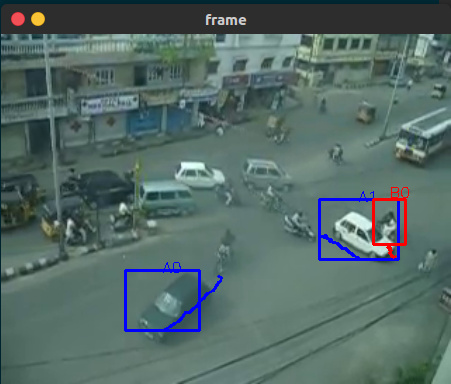
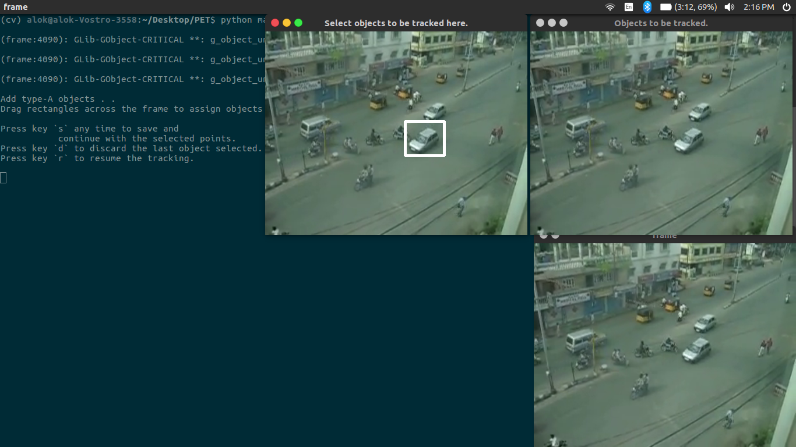
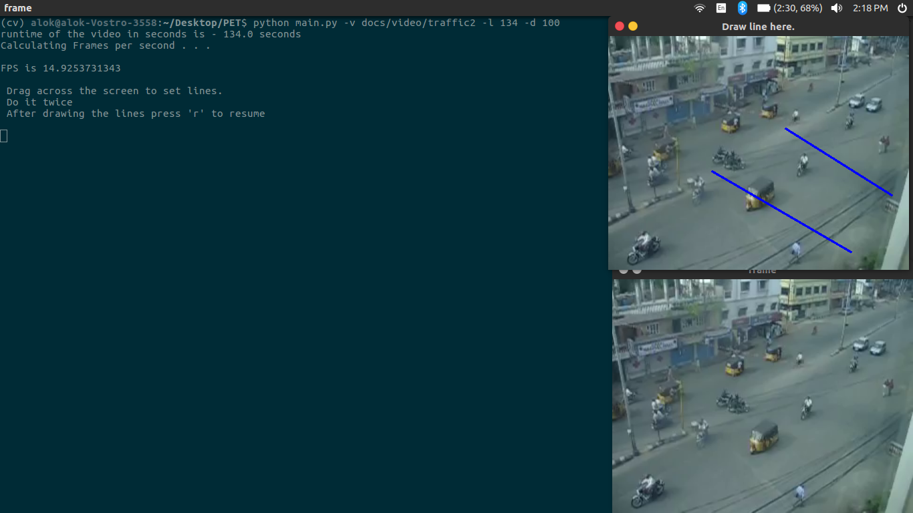
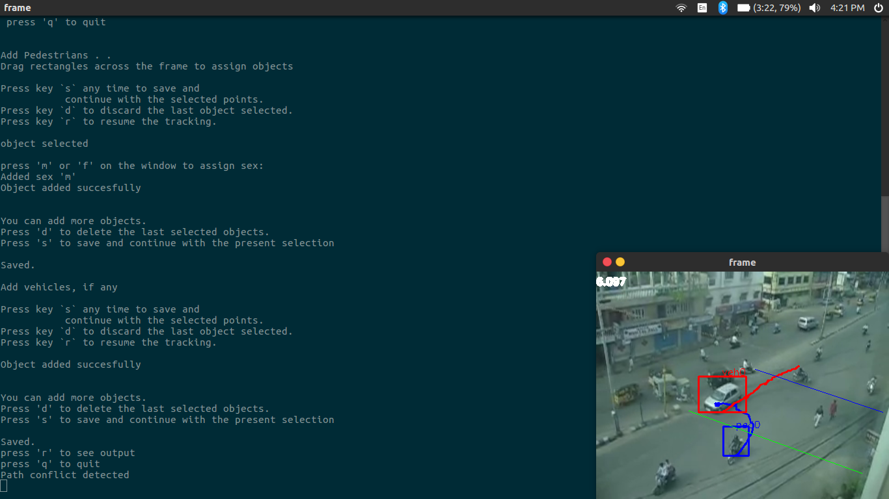
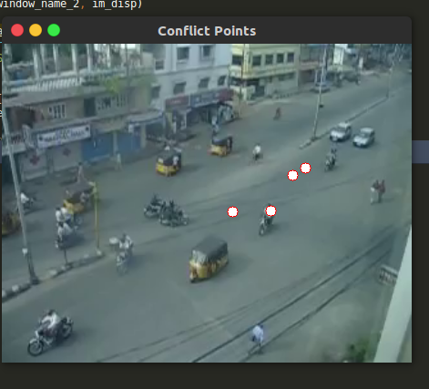
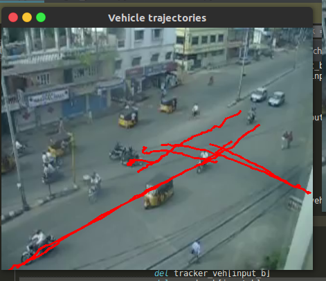

# Multi ObjectTracker
Advanced multiple object tracker using <b>dlib</b> and <b>openCV</b> library.
<br><br>


This is my summer(2017) project under the guidance of Prof P Vedagiri (IIT B , Civil department) at the end of my 2nd semester. This pertains to automating the detection of pedestrian-vehicle conflicts by using image processing. The objective was to find out <a href="https://www.researchgate.net/figure/7232990_fig1_Fig-1-Illustration-of-post-encroachment-time-PET"> Post Encroachment Time (PET)</a> values semi-autonomously.

This program has two modes. The <b>normal mode</b> can track multiple instances of user specified objects of 2 categories as they move across the frames. The second mode consists a suite of data analysis of the object trajectories obtained for the transportation department purposes. 


## Dependencies

* [`Dlib` with Python support](http://dlib.net/)
* [`OpenCV` with Python support](http://opencv.org)
* [`xlwt` python package(for writing on excel files to store PET values)](https://pypi.python.org/pypi/xlwt)

## Starting the code

### Normal mode

To run the code using a video file use the following command line argument --

```shell
python main.py -v <path-2-video-file>
```

For example, you can use the demo video provided with this code as --

```shell
python main.py -v docs/video/traffic2
```


Once the code starts, it will play video file. To select the objects to be tracked, pause the video by pressing the <kbd>p</kbd> key. It will first ask you to  to create a bounding box around the object(s) to be tracked in the newsly created window. Press the mouse to select the top-left pixel location of the object to be tracked and then release the mouse on the bottom-right location of the object to be tracked. You can select multiple instaces of a type of object



Also, if you want to discard the last selected object, press the <kbd>d</kbd> key. Press <kbd>s</kbd> key to save the category of objects and initiate the tracker.Each object is assigned an index, which will be useful in deleting instances of the trackers. press <kbd>r</kbd> key anytime to resume tracking without saving the currently selected objects.

This process is done twice to track objects of 2 categories. You may fill objects of one category only if you choose so. You can always pause and add ibjects later

Whenever the video is playing, you can press <kbd>d</kbd> key to delete instances of the object you do not want. Further instruction will appear on the terminal window

You can always pause and resume the tracking. It doesn't lead to any loss of tracker objects.

Press <kbd>q</kbd> anytime to gracefully quit the code

### Analysis mode


Additional flags -l is needed for calculating PET and using the analysis mode.

If the -l flag is not provided, main.py simply acts as multiple object tracker.

The -l is followed by the length of the video to be played in seconds. This is important for finding out PET values, as we need the frame processing rate. The runtime of the video is essential. 

```shell
-l <run time length of the video in seconds>
```
In the first frame, it asks you to draw two reference lines in the image. This reference lines are the lines in real world whose separation distance, you know earlier from field observation. These reference lines will be used in calculating avg velocity of the vehicles for analysis purpose



Set the distance between two reference lines(in metres) with the flad -d. The distance is set as 100 in default. 

```shell
-d <distance between to reference lines
```

What follows next is the same procedure for adding objects to track as in normal mode. It forst asks you for adding pedestrians and then vehicles. Trajectory of each object is tracked and stored. The algorithm in algo.py and intersect.py help in detecting whenever a vehicle lands at a point where the pedestrian was present erstwhile. If -l flag is provided then PET values calculated are stored in an excel file.




A sample commandline instruction for the provided sample video, whose runtime is around 134 seconds, in analysis mode could b -

```shell
python main.py -v docs/video/traffic2 -l 134 -d 100
```
After the video playback is over, or if you quit the program inbetween, it does analysis of the trajectories and displays the following - 
* Points in the video where path conflict took place - <br>

 
 
* Trajectory of the vehicles and pedestrians we have tracked - <br>
 
 
 
* Saves an excel sheet whose column headers are PET values, Sex of the pedestrian, Speed of the vehicle, Time in the video at which the said conflict took place and the coordinate in the video where it took place

  
  <i>important to note that speed of the vehicle gets stores only of it crosses both the reference lines</i>


